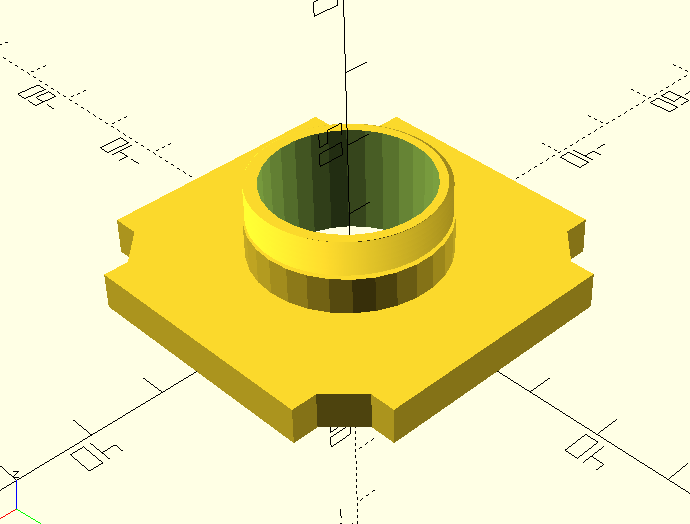

# openUC2 solutions for DoMB

Fork of [openUC2 Project](https://github.com/openUC2/UC2-GIT?tab=readme-ov-file)

This repo will contain hardware solutions and adaptations of original openUC2 parts/projects for our experimental work in the Department of Molecular Biophysics at Bogomoletz Institute of Physiology (Kyiv, Ukraine).

---

## openSCAD C-mount cube insert
Parametric model of a cube insert with C-mount thread.

## Z-stage with CD-drive steppers
In progress.

## XY-stage with CD-drive steppers
In progress.