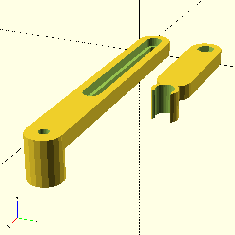
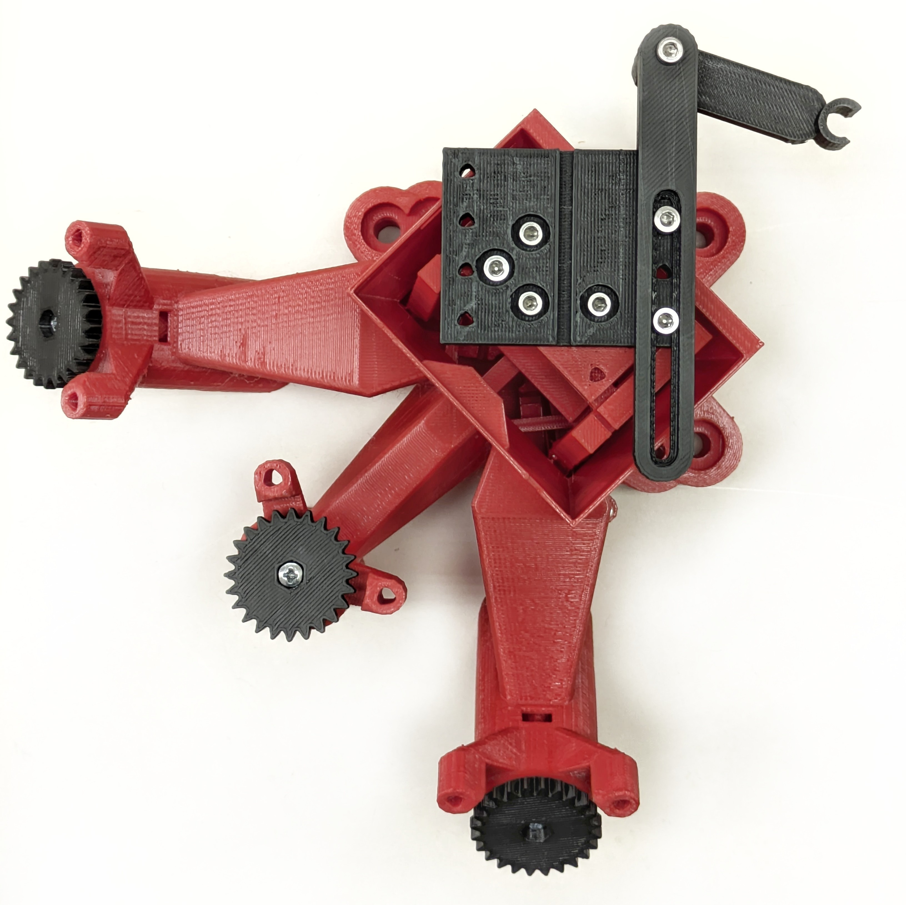

__SPIM for DoMB__
================

Selective Plane Illumination Microscope based on adaptations and modifications of original [openUC2](https://github.com/openUC2/UC2-GIT?tab=readme-ov-file) and [OpenFlexure Block Stage](https://gitlab.com/openflexure/openflexure-block-stage/) projects.

Department of Molecular Biophysics, Bogomoletz Institute of Physiology of NAS of Ukraine (Kyiv, Ukraine).

---

# System overview

</a>

The microscope consists of three main parts: (__1__) excitation light path with a light source and light sheet collimation system, (__2__) sample handling part which includes a sample chamber with modified OpenFlexure Block Stage and side illumination system, and (__3__) detection light path with emission filter, tube lens, and industrial-grade CMOS camera ([FLIR Grasshopper 3](https://www.edmundoptics.com/p/gs3-u3-23s6m-c-112-grasshopper-usb-30-monochrome-camera/30859/?srsltid=AfmBOor05Spkup9nlj1Yhpo8lcCk5ABTsBXECeMxt9GTolSTdF2UEIqc) in our case). A solid yellow line indicates the excitation and detection light path, and a dashed yellow line indicates the brightfield side-illumination light path. 

The whole setup is based on on-shelf parts and low-cost solutions with minimal additional modifications. For all 3D-printed parts, parametric openSCAD models were provided for flexible modification customization without a great entry threshold.  

This system is under strong development, so check for future updates.

__3D reconstruction of whole-mount staining of vessels endothelial cells in the sciatic nerve__

> [!TIP]
>
> Read more about the SPIM principles: 
>
> - [Selective Plane Illumination Microscopy](https://link.springer.com/chapter/10.1007/978-0-387-45524-2_37)
> - [openSPIM project](https://openspim.org/)
> - [Selective plane illumination microscopy techniques in developmental biology](https://journals.biologists.com/dev/article/136/12/1963/65234/Selective-plane-illumination-microscopy-techniques)
> - [Using tissue clearing and light sheet fluorescence microscopy for the three-dimensional analysis of sensory and sympathetic nerve endings that innervate bone and dental tissue of mice](https://login.research4life.org/tacsgr1onlinelibrary_wiley_com/doi/full/10.1002/cne.25582)

---

# Construction notes
The microscope was built on a 30x50 cm M6 threads optical breadboard.

## 1. Excitation light path

## 2. Sample handling

## 3. Detection light path

---

# Cubes and modules
## OpenFlexure Block Stage and sample holder

The original OpenFlexure Block stage has only ~2 mm travel distances in each direction, which is not enough for large sample imaging. So, due to the parametric nature of the OpenFlexure Block Stage model, I just adjusted several variables in the `parameters.scad` file to obtain an STL model of the stage with enlarged travel distances.  Additionally, I established a new variable `platform_z_add` which was just a constant in `platform_z` calculation (line 80) to control base high.

I am listing the changed parameters below, travel distances for the final version are ~6 mm across the XY axes and ~3 mm across the Z axis:

| Variable               | Original value | Adjusted value |
| ---------------------- | -------------- | -------------- |
| `beam_height`          | 75             | 100            |
| `stage_to_beam_height` | 12.5           | 0              |
| `xy_lever`             | 10             | 30             |
| `flex_a`               | 0.1            | 0.2            |
| `platform_z_add`       | 7              | 20             |

Good practice for sample fixation during SPIM imaging is embedding the sample in agarose gel. 1 ml syringes are very suitable for large samples, so I designed a "lego figure hand"-like holder for a standard 1 ml insulin syringe. 

 Sample holder model V0 | Block Stage top view   | Block stage side view 
:-------------------------:|:-------------------------:|:-------------------------:
| | 

## C-mount adapter
Parametric model of a cube insert with C-mount thread (_c-mount_insert_v0.scad_).

Model         | 
:-------------------------:|:-------------------------:
__Printed long insert__ | 
__Installed insert__| 

##  LED/power cube V0
Parametric model of a cube insert with two LED dimmers and 12V output with type-C Power Delivery input (_led_power_insert_v0.scad_).

__Model__

Part|#|Cost/unit|Link
-|-|-|-
LED dimmer | 2x | $2.72   | [AliExpress](https://a.aliexpress.com/_EuX3DTP) 
PD decoy module 12V | 1x | $0.44   | [AliExpress](https://a.aliexpress.com/_Ezeg4Hf) 
Mini560 Pro Step Down to 3.3V| 1x | $0.81  | [AliExpress](https://a.aliexpress.com/_EJQFP5x) 
White LED 10W 3V (XML2) | 1x | $1.29  | [AliExpress](https://a.aliexpress.com/_EHBMyXT) 
460 nm LED 3W 3V (10 pc) | 1x | $1.94   | [AliExpress](https://a.aliexpress.com/_EI94HWN)
XT30 connector | 3x | $0.6  | [arduino.ua](https://arduino.ua/prod5276-xt30-konnektor-para-dlya-podklucheniya-li-po-li-ion-akkymylyatorov)

Assembled power cube            | 
:-------------------------:|:-------------------------:
__Power cube with two LED cubes__ | 

__White 10W LED cube with radiator from northbridge__

Front view            |  Back view
:-------------------------:|:-------------------------:
 | 

## 25 mm filter holder V1
Sliding holder for standard 25 mm optical filters. The storage box for filter holders has mounting holes for standard M6 25mm spacing optical board.

__Model__

Assembled filter cube             | Filter cube with filter holders and holders storage box 
:-------------------------:|:-------------------------:
 | 

## Servo stage V1
The holder was adapted to install a plastic photometric cuvette for sample mounting.

__Model__

_Includes openSCAD library "Bibliothek für Evolventen-Zahnräder, Schnecken und Zahnstangen" (gear.scad)_

__Assembled cube__

Top view            |  Side view
:-------------------------:|:-------------------------:
 | 

## 5X Laser beam expander V0

__Model__

Part|#|Cost/unit|Link
-|-|-|-
Acrilic LED lens, F22 D20.8 | 1x | $1.35 | [AliExpress](https://a.aliexpress.com/_EHJOUo1) 
iPhone 4S lens, F3.85 | 1x |  -  |  

## RGB laser module V0

Module for mounting and control with Arduino of the RGB laser LED module.

Part|#|Cost/unit|Link
-|-|-|-
RGB laser module | 1x | $19.5 | [AliExpress](https://a.aliexpress.com/_EHowiiN)
Arduino Nano type-C | 1x | $2.13 | [AliExpress](https://a.aliexpress.com/_EwrjzyD) 
Arduino Nano expansion board | 1x | $0.94 | [AliExpress](https://a.aliexpress.com/_EyNqegd) 
PD decoy module 12V | 1x | $0.44 | [AliExpress](https://a.aliexpress.com/_Ezeg4Hf) 

__RGB laser trigger board modification__

The original diode bridge on the RBG laser trigger board (circled in red) was replaced with two jumpers for the DC power supply only, and the original trigger connectors were replaced with 2.54 mm pin headers.

Original board             |  Modified board
:-------------------------:|:-------------------------:
 | 

__Nano expansion board modification__

The expansion board's original DC connector (circled in red) was replaced with a PD trigger module for power supply with a power delivery source (AC adapter, power bank, etc.).

Original board (top)            |  Modified board (top)
:-------------------------:|:-------------------------:
 | 

Arduino pin 2 was pulled up with a 1K resistor to the 5V (circled in red) for connection to the passive trigger output of the Point Grey Grasshopper 3 camera (trigger output - pin 2, gnd - pin 6). The male XT30 connector for an optional power supply from the LED/power cube was soldered to the power input. 

Original board (bottom)            | Modified board (bottom) 
:-------------------------:|:-------------------------:
 |  

__Assembled control module__

Lasers powered through an arduino Vin pin.

TTL inputs of the RGB laser trigger board  was connected to the next arduino pins:

- __650 nm__ - 8
- __520 nm__ - 9
- __450 nm__ - 10

Trigger board holder  | Assembled module 
:-------------------------:|:-------------------------:
 |  

For arduino operating details see [Step-by-step to controlling multiple light sources with an Arduino](https://github.com/nimwegenLab/MiM_NikonTi/blob/master/Docs/NikonTi_hardware_triggering.m).

---

# Software
All control is provided with [Micro-Manager](https://micro-manager.org/) and [pymmcore-plus](https://pymmcore-plus.github.io/pymmcore-plus/) library with [napari-micromanager](https://pymmcore-plus.github.io/napari-micromanager/) GUI.

__Configuration__
|Component | Desctiption | Micro-manager adapter| Note |
|- | - | - | - |
|Camera | FLIR Grasshopper3 USB3 | [Point Grey Research](https://micro-manager.org/Point_Grey_Research)| |
|Stage | Servo stage | [CustomArduino](https://micro-manager.org/CustomArduino) (MarzhauserLStep Z-stage)| Set AnswerTimeout to 5000.000 |
|Lasers | RGB laser control wtih TTL | [Arduino](https://micro-manager.org/Arduino)| Change MM Ardu version in sketch to 2 |

---

# Useful links

- [Grasshopper3 USB 3.1 manual, PDF](https://www.physics.utoronto.ca/apl/fvf/GS3-U3-Technical-Reference.pdf)
- [Step-by-step to controlling multiple light sources with an Arduino for sequenceable MDA by Guillaume Witz & Thomas Julou](https://github.com/nimwegenLab/MiM_NikonTi/blob/master/Docs/NikonTi_hardware_triggering.m)