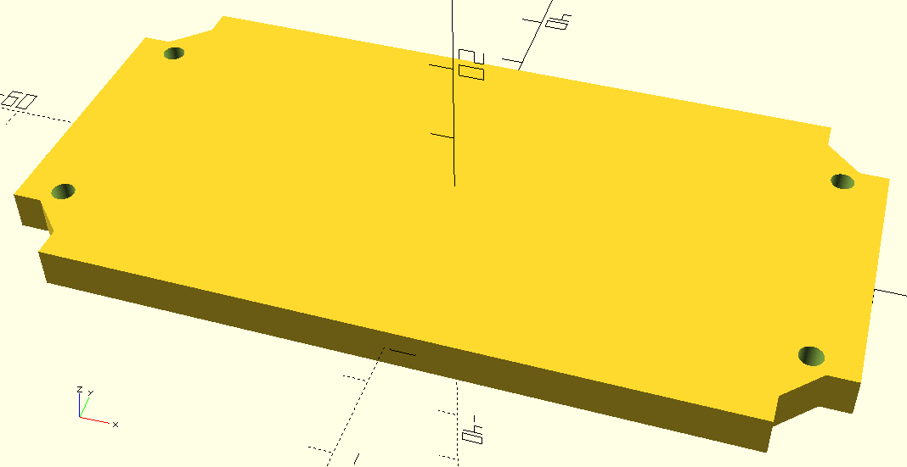

# openUC2 solutions for DoMB

Fork of [openUC2 Project](https://github.com/openUC2/UC2-GIT?tab=readme-ov-file)

This repo will contain hardware solutions and adaptations of original openUC2 parts/projects for our experimental work in the Department of Molecular Biophysics at Bogomoletz Institute of Physiology (Kyiv, Ukraine).

---

# Hardware
## C-mount adapter
Parametric model of a cube insert with C-mount thread (_c-mount_insert_v0.scad_).

__Model__

__Printed long insert__

__Installed insert__

##  LED control and power source V0
Parametric model of a cube insert with two LED dimmers and 9V output with type-C Power Delivery input (_led_power_insert_v0.scad_).

__Model__

Part|#|Cost/unit|Link
-|-|-|-
LED dimmer | 2x | $2.72   | [AliExpress](https://a.aliexpress.com/_EuX3DTP) 
PD module 9V | 1x | $0.44   | [AliExpress](https://a.aliexpress.com/_Ezeg4Hf) 
Mini560 Pro Step Down to 3.3V| 1x | $0.81  | [AliExpress](https://a.aliexpress.com/_EJQFP5x) 
White LED 10W 3V (XML2) | 1x | $1.29  | [AliExpress](https://a.aliexpress.com/_EHBMyXT) 
460 nm LED 3W 3V (10 pc) | 1x | $1.94   | [AliExpress](https://a.aliexpress.com/_EI94HWN)
XT30 connector | 3x | $0.6  | [arduino.ua](https://arduino.ua/prod5276-xt30-konnektor-para-dlya-podklucheniya-li-po-li-ion-akkymylyatorov)

__Assembled power cube__

__Power cube with two LED cubes__

__White 10W LED cube with radiator from northbridge__

## Servo stage for light-sheet V1
The holder was adapted to install a plastic photometric cuvette for sample mounting.

__Model__

_Inclides openSCAD library "Bibliothek für Evolventen-Zahnräder, Schnecken und Zahnstangen" (gear.scad)_

__Assembled cube__

## RGB laser block V0

The first version for the RGB laser module is just a horizontal insert for 2x base cube with four mount holes.

__Model__

Part|#|Cost/unit|Link
-|-|-|-
RGB laser module | 1x | $19.5 | [AliExpress](https://a.aliexpress.com/_EHowiiN)
DIN 912 M3 | 4x |  -  | [AliExpress](https://a.aliexpress.com/_EuX3DTP) 
M3 nuts | 4x |  -  | [AliExpress](https://a.aliexpress.com/_EuX3DTP) 

---

# Software
All control is provided with [Micro-Manager](https://micro-manager.org/) and [pymmcore-plus](https://pymmcore-plus.github.io/pymmcore-plus/) library with [napari-micromanager](https://pymmcore-plus.github.io/napari-micromanager/) GUI.

__Configuration__
Component | Desctiption | Micro-manager adapter
- | - | -
Camera | FLIR Grasshopper3 USB3 | [Point Grey Research](https://micro-manager.org/Point_Grey_Research)
Stage | Servo stage | [CustomArduino](https://micro-manager.org/CustomArduino) (MarzhauserLStep Z-stage)

_Note: AnswerTimeout property for the servo stage was set to 5000.000_