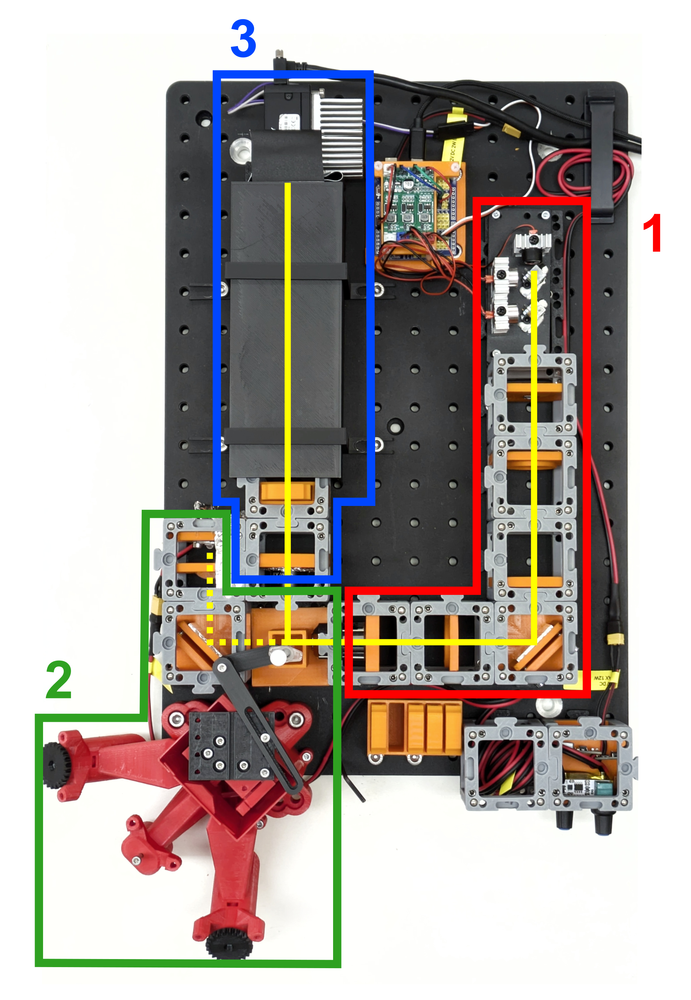

[](https://stand-with-ukraine.pp.ua)


<p align="left">
<a href="#logo" name="logo"></a>
</p>


[](https://gitlab.com/openflexure)


__SPIM for DoMB__
================

Selective Plane Illumination Microscope based on adaptations and modifications of original [openUC2](https://github.com/openUC2/UC2-GIT?tab=readme-ov-file) and [OpenFlexure Block Stage](https://gitlab.com/openflexure/openflexure-block-stage/) projects.

Department of Molecular Biophysics, Bogomoletz Institute of Physiology of NAS of Ukraine (Kyiv, Ukraine).

---

# L-SPIM system overview

## Microscope configuration
<p align="center">
</a>
</p>

The microscope consists of three main parts: (__1__) excitation light path with a light source, light source control board, and light sheet collimation system, (__2__) sample handling part which includes a sample chamber with modified OpenFlexure Block Stage and side illumination system, and (__3__) detection light path with emission filter, tube lens, and industrial-grade CMOS camera ([FLIR Grasshopper 3](https://www.edmundoptics.com/p/gs3-u3-23s6m-c-112-grasshopper-usb-30-monochrome-camera/30859/?srsltid=AfmBOor05Spkup9nlj1Yhpo8lcCk5ABTsBXECeMxt9GTolSTdF2UEIqc) in our case). A solid yellow line indicates the excitation and detection light path, and a dashed yellow line indicates the brightfield side-illumination light path. 

The whole setup is based on on-shelf parts and low-cost solutions with minimal additional modifications. For all 3D-printed parts, parametric openSCAD models were provided for flexible modification and customization without a great entry threshold.  

This system is under strong development, so check for future updates.

## First results

__Light sheet configuration__
 Light sheet top view | Light sheet side view | Light sheet focus point view 
:-------------------------:|:-------------------------:|:-------------------------:
||  

__Z-stack and reconstruction of whole mount staining of vessels endothelial cells in the sciatic nerve__


> [!TIP]
>
> Read more about the SPIM principles: 
>
> - [Selective Plane Illumination Microscopy](https://link.springer.com/chapter/10.1007/978-0-387-45524-2_37)
> - [openSPIM project](https://openspim.org/)
> - [Selective plane illumination microscopy techniques in developmental biology](https://journals.biologists.com/dev/article/136/12/1963/65234/Selective-plane-illumination-microscopy-techniques)
> - [Using tissue clearing and light sheet fluorescence microscopy for the three-dimensional analysis of sensory and sympathetic nerve endings that innervate bone and dental tissue of mice](https://onlinelibrary.wiley.com/doi/full/10.1002/cne.25582)


## Construction notes
General materials and parts needed for printing and assembling:

| Part                               | #     | Cost/unit | Link                                                         |
| ---------------------------------- | ----- | --------- | ------------------------------------------------------------ |
| Optical breadboard 30x45 cm        | 1x    | $135      | [AliExpress](https://a.aliexpress.com/_EwQ40qd)              |
| M3x12 DIN912 screw                 | ~200x | ~$8 / 200 | Metalvis                                                     |
| M6x12 DIN912 screw                 | ~30x  | ~$6 / 30  | Metalvis                                                     |
| M6x12 DIN912 screw                 | ~10x  | ~$1 / 10  | Metalvis                                                     |
| M5x8 DIN914 screw                  | ~150x | ~$5 / 150 | Metalvis                                                     |
| 1.75 mm PLA filament (750 g/pack)  | 2x    | $11       | [Monofilament](https://monofilament.com.ua/ua/products/standartnye-materialy/pla/pla-cvetlo-seryj-o1-75mm-ves0-75kg) |
| 1.75 mm ABS+ filament (750 g/pack) | 1.5x  | $10.85    | [Monofilament](https://monofilament.com.ua/ua/products/standartnye-materialy/abs-plus/abs-plus-oranzhevyj) |
| __Total__                          |       | __~$200__ |                                                              |

## 1. Excitation light path

<p align="center">
</a>
</p>

1. [RGB lasers module and lasers trigger board](#rgb-laser-module-v0)
2. ~12x beam expander: iPhone 4S lens F3.85 and F50 lens
3. Cylinrical lens F30
4. 45° kinematic mirror
5. Focusing lens F50
6. Projection objective 10x NA 0.25

| Part                                      | #    | Cost/unit | Link                                            |
| ----------------------------------------- | ---- | --------- | ----------------------------------------------- |
| [RGB lasers module](#rgb-laser-module-v0) | 1x   | $23       |                                                 |
| iPhone 4S lens F3.85                      | 1x   | -         |                                                 |
| F50 D30 lens                              | 2x   | $0.68     | [AliExpress](https://a.aliexpress.com/_ExOjTDP) |
| F30 20x22 mm cylindrical lens             | 1x   | $10.54    | [AliExpress](https://a.aliexpress.com/_EuDzlJ3) |
| Fron surface mirror 30x30 mm              | 1x   | $1.46     | [AliExpress](https://a.aliexpress.com/_EHn0u2l) |
| 10x NA 0.25 infinity corrected objective  | 1x   | $15.54    | [AliExpress](https://a.aliexpress.com/_ExDrPj7) |
| __Total__                                 |      | __~$52__  |                                                 |

## 2. Sample handling

<p align="center">
</a>
</p>

1. [White LED 3.3V 10W](#led-and-power-cube-v0) and 45° kinematic mirror
2. [OpenFlexure Block Stage with sample holder](#openflexure-block-stage-and-sample-holder)
3. [Sample chamber](#sample-chamber-v0)

| Part                                         | #    | Cost/unit | Link                                            |
| -------------------------------------------- | ---- | --------- | ----------------------------------------------- |
| [LED and power cube](#led-and-power-cube-v0) | 1x   | $12.68    |                                                 |
| Fron surface mirror 30x30 mm                 | 1x   | $1.46     | [AliExpress](https://a.aliexpress.com/_EHn0u2l) |
| __Total__                                    |      | __~$14__  |                                                 |


## 3. Detection light path

<p align="center">
</a>
</p>

1. Objective 4x NA 0.1
2. [Emission filter holder](#25-mm-filter-holder-v1)
3. Tube lens ~F180
4. Light protection enclosure
5. CMOS camera and [C-mount cube](#c-mount-adapter)

| Part                                   | #    | Cost/unit                                  | Link                                                         |
| -------------------------------------- | ---- | ------------------------------------------ | ------------------------------------------------------------ |
| 4x NA 0.1 infinity corrected objective | 1x   | $13.25                                     | [AliExpress](https://a.aliexpress.com/_ExDrPj7)              |
| 25 mm emission filter                  | 1x   | discontinued old filter set, but new >$300 |                                                              |
| F~180 D40 lens                         | 1x   | from old stereomicroscope                  |                                                              |
| FLIR Grasshopper 3                     | 1x   | $1179                                      | [Edmund Optics](https://www.edmundoptics.com/p/gs3-u3-23s6m-c-112-grasshopper-usb-30-monochrome-camera/30859/?srsltid=AfmBOor05Spkup9nlj1Yhpo8lcCk5ABTsBXECeMxt9GTolSTdF2UEIqc) |
| __Total__                              |      | __~$1195__                                 |                                                              |

> [!IMPORTANT]
>
> The cost of the entire microscope, excluding the CMOS camera and emission filters set, was less than $300. A possible alternative for expensive emission filters may be industrial-grade filters for multimedia projector systems, but with a minimal selection of possible passbands. I also recommend paying attention to other manufacturers of industrial monochrome cameras: [Allied Vision](https://www.alliedvision.com/en/products/camera-series/alvium-1800-u/), [Basler](https://www.baslerweb.com/en/cameras/?srsltid=AfmBOooR76UWs6U6YJbZBzX9LeqmtPnLls9piX8MenW-n_NOVcxJU0dT), [Daheng](https://en.daheng-imaging.com/list-2-1.html).


---

# Theoretical notes
## Gaussian litgh-sheet
_Based on [Olarte et al., 2018](https://opg.optica.org/aop/fulltext.cfm?uri=aop-10-1-111&id=381035) and [Power and  Huisken, 2017](https://whttps://opg.optica.org/aop/fulltext.cfm?uri=aop-10-1-111&id=381035ww.nature.com/articles/nmeth.4224)._

__Schematic of the illumination and detection arm in a SPIM__ (_Olarte et al., 2018_)
<p align="center">
</a>
</p>

### Illumination arm
Light-sheet thickness (axial sectioning resolution): 

```math
l_z = 2w_0 = 2 \frac{n \cdot \lambda_{ex.}}{\pi \cdot NA_{ex.}}
```

Light-sheet length (field of view/FOV):

```math
l_x = 2z_r = 2 \frac{\pi \cdot w_0^2}{\lambda_{ex.}} = 2 \frac{n^2 \cdot \lambda_{ex.}}{\pi \cdot NA_{ex.}^2}
```


### Detection arm
Lateral resolution (Rayleigh criterion):

```math
d_{xy} = \frac{0.61 \cdot \lambda_{det.}}{NA_{det.}}
```

Axial resolution (depth of field/DOF):

```math
d_z = \frac{n \cdot \lambda_{det.}}{NA_{det.}^2}
```


## Samples and desired characteristics
### Sciatic nerve
- Nerve diameter: 1.5-2 mm
- Nerve length: 5-20 mm
- A-fiber diameter: 1.5 - 10 um 
- C-fiber diameter: 0.5 - 2 um
- Minimal vessel diameter

__NB: is 10x NA 0.3 FN 22 enough?__

## Relation of components and parameters
### Objective

| Model                           | Olympus UPlanFl Ph. 1 |
| ------------------------------- | --------------------- |
| Magnification (M)               | 10x                   |
| Numerical aperture (NA)         | 0.3                   |
| Working distance (WD)           | 10 mm                 |
| Focal distance (F)              | 18 mm                 |
| Back focal plane distance (BFP) | -19.1 mm              |
| Field number (FN)               | 26.5 mm               |
| Lateral resolution              | 1.12 um               |
| Parafocal distance (PD)         | 65 mm                 |
| Exit pupil diameter (EP)        | 10.8 mm               |


---

# T-SPIM 
Here will be construction notes for the next project, T-SPIM extension of DoMB-SPIM.

---

# Cubes and modules
## OpenFlexure Block Stage for SPIM

Active development of OpenFlexure Block Stage adaptation continues on a separate [repository](https://github.com/Belan-Lab/OpenFlexure-XYZR).

__Block Stage side view__
<p align="center">
</a>
</p>

## C-mount adapter
Parametric model of a cube insert with C-mount thread (_c-mount_insert_v0.scad_).

Model         | 
:-------------------------:|:-------------------------:
__Printed long insert__ | 
__Installed insert__| 


##  LED and power cube V0
Parametric model of a cube insert with two LED dimmers and 12V output with type-C Power Delivery input (_led_power_insert_v0.scad_).

__Model__


Part|#|Cost/unit|Link
-|-|-|-
LED dimmer | 2x | $2.72   | [AliExpress](https://a.aliexpress.com/_EuX3DTP) 
PD decoy module 12V | 1x | $0.44   | [AliExpress](https://a.aliexpress.com/_Ezeg4Hf) 
Mini560 Pro Step Down to 3.3V| 1x | $0.81  | [AliExpress](https://a.aliexpress.com/_EJQFP5x) 
White LED 10W 3.3V (XML2) | 1x | $1.29  | [AliExpress](https://a.aliexpress.com/_EHBMyXT) 
460 nm LED 3W 3.3V | 1x | $0.2 | [AliExpress](https://a.aliexpress.com/_EI94HWN)
Acrilic LED lens, F22 D20.8 | 2x | $1.35 | [AliExpress](https://a.aliexpress.com/_EHJOUo1) 
XT30 connector | 3x | $0.6  | [arduino.ua](https://arduino.ua/prod5276-xt30-konnektor-para-dlya-podklucheniya-li-po-li-ion-akkymylyatorov)
__Total__ |  | __$12.68__ | 

Assembled power cube            | 
:-------------------------:|:-------------------------:
__Power cube with two LED cubes__ | 


__White 10W LED cube with radiator from northbridge__

Front view            |  Back view
:-------------------------:|:-------------------------:
 | 


## 25 mm filter holder V1
Sliding holder for standard 25 mm optical filters. The storage box for filter holders has mounting holes for standard M6 25mm spacing optical board.

__Model__


Assembled filter cube             | Filter cube with filter holders and holders storage box 
:-------------------------:|:-------------------------:
 | 


## Sample chamber V0
Sample chamber with three glass walls, as chamber windows was used 18 mm diameter 0.18 mm thickness coverslips mounted on silicone sealant.

Model           |  Assembled chamber
:-------------------------:|:-------------------------:
 | 

## Servo stage V1
The holder was adapted to install a plastic photometric cuvette for sample mounting.

__Model__

_Includes openSCAD library "Bibliothek für Evolventen-Zahnräder, Schnecken und Zahnstangen" (gear.scad)_

__Assembled cube__

Top view            |  Side view
:-------------------------:|:-------------------------:
 | 


## 5X Laser beam expander V0

__Model__


Part|#|Cost/unit|Link
-|-|-|-
Acrilic LED lens, F22 D20.8 | 1x | $1.35 | [AliExpress](https://a.aliexpress.com/_EHJOUo1) 
iPhone 4S lens, F3.85 | 1x |  -  |  

## RGB lasers module V0

Module for mounting and control with Arduino of the RGB laser LED module.

Part|#|Cost/unit|Link
-|-|-|-
RGB laser module | 1x | $19.5 | [AliExpress](https://a.aliexpress.com/_EHowiiN)
Arduino Nano compatible board | 1x | $2.13 | [AliExpress](https://a.aliexpress.com/_EwrjzyD) 
Arduino Nano expansion board | 1x | $0.94 | [AliExpress](https://a.aliexpress.com/_EyNqegd) 
PD decoy module 12V | 1x | $0.44 | [AliExpress](https://a.aliexpress.com/_Ezeg4Hf) 
__Total__ |  | __$23__ |  

__RGB laser trigger board modification__

The original diode bridge on the RBG laser trigger board (circled in red) was replaced with two jumpers for the DC power supply only, and the original trigger connectors were replaced with 2.54 mm pin headers.

Original board             |  Modified board
:-------------------------:|:-------------------------:
 | 

__Nano expansion board modification__

The expansion board's original DC connector (circled in red) was replaced with a PD trigger module for power supply with a power delivery source (AC adapter, power bank, etc.).

Original board (top)            |  Modified board (top)
:-------------------------:|:-------------------------:
 | 

Arduino pin 2 was pulled up with a 1K resistor to the 5V (circled in red) for connection to the passive trigger output of the Point Grey Grasshopper 3 camera (trigger output - pin 2, gnd - pin 6). The male XT30 connector for an optional power supply from the LED/power cube was soldered to the power input. 

Original board (bottom)            | Modified board (bottom) 
:-------------------------:|:-------------------------:
 |  

__Assembled control module__

Lasers powered through an arduino Vin pin.

TTL inputs of the RGB laser trigger board  was connected to the next arduino pins:

- __650 nm__ - 8
- __520 nm__ - 9
- __450 nm__ - 10

Trigger board holder  | Assembled module 
:-------------------------:|:-------------------------:
 |  

For arduino operating details see [Step-by-step to controlling multiple light sources with an Arduino](https://github.com/nimwegenLab/MiM_NikonTi/blob/master/Docs/NikonTi_hardware_triggering.m).

---

# Software
All control is provided with [Micro-Manager](https://micro-manager.org/) and [pymmcore-plus](https://pymmcore-plus.github.io/pymmcore-plus/) library with [napari-micromanager](https://pymmcore-plus.github.io/napari-micromanager/) GUI.

__Configuration__
|Component | Desctiption | Micro-manager adapter| Note |
|- | - | - | - |
|Camera | FLIR Grasshopper3 USB3 | [Point Grey Research](https://micro-manager.org/Point_Grey_Research)| |
|Stage | Servo stage | [CustomArduino](https://micro-manager.org/CustomArduino) (MarzhauserLStep Z-stage)| Set AnswerTimeout to 5000.000 |
|Lasers | RGB laser control wtih TTL | [Arduino](https://micro-manager.org/Arduino)| Change MM Ardu version in sketch to 2 |

## Useful links

- [Grasshopper3 USB 3.1 manual, PDF](https://www.physics.utoronto.ca/apl/fvf/GS3-U3-Technical-Reference.pdf)
- [Step-by-step to controlling multiple light sources with an Arduino for sequenceable MDA by Guillaume Witz & Thomas Julou](https://github.com/nimwegenLab/MiM_NikonTi/blob/master/Docs/NikonTi_hardware_triggering.m)