# Assemble the actuators

{{BOM}}

[2.5mm Allen key]: "{cat:tool}"
[light oil]: "{cat:tool}"

## Attach Base {pagestep}

Attach the [prepared main body](fromstep){qty:1, cat:3DPrinted} to the [base](fromstep){Qty: 1, cat:3DPrinted} via the little lugs with three [M3x6mm screws][M3x6mm screw]{Qty: 3} using a [2.5mm Allen key]{qty:1}.
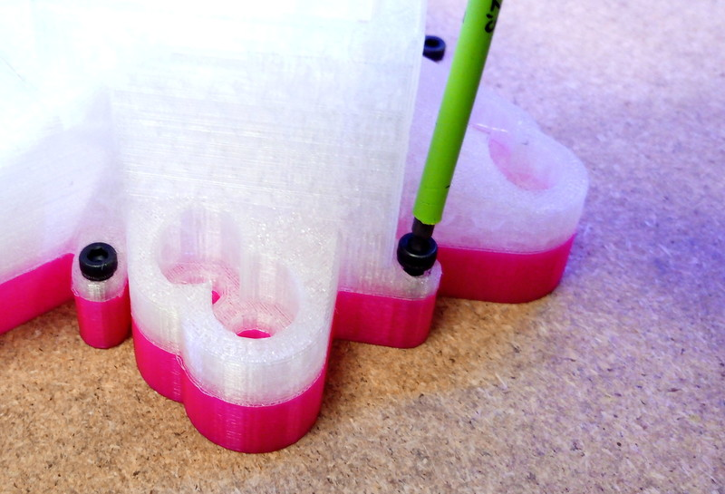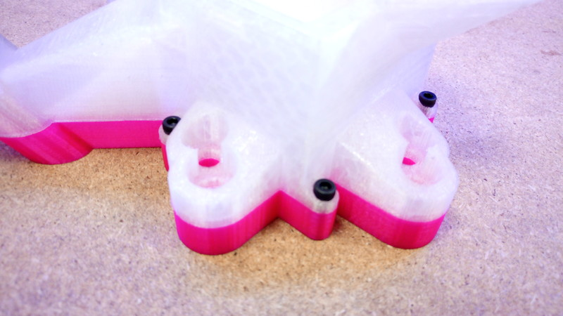

[M3x6mm screw]: Hardware.yaml#CapScrew_M3x6mm_SS

## Assembling an actuator {pagestep}

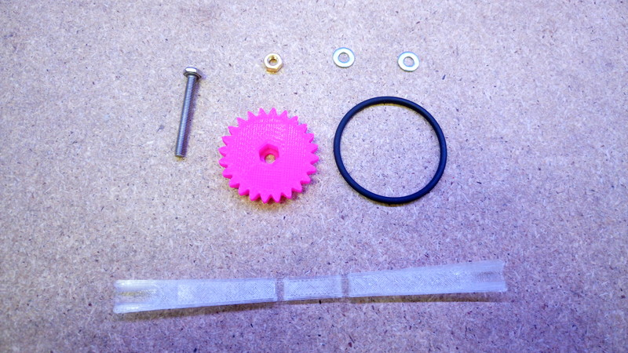

Insert a [brass M3 nut]{Qty: 3} into the slot on one of the actuator columns of the main body (this is sometimes made easier with the nut tool. The nut tool is the shorter of the two [actuator assembly tools](fromstep){Qty: 1, cat:PrintedTool} and is missing from the above picture.

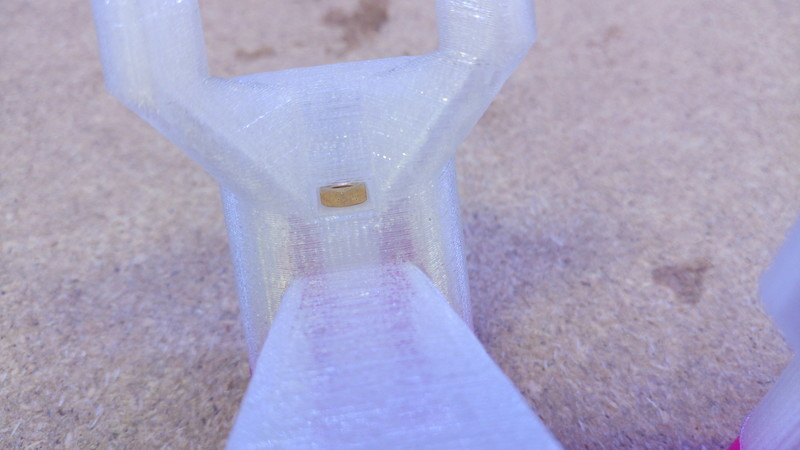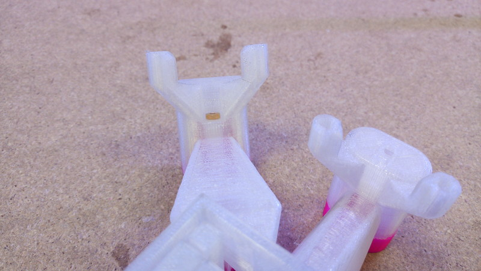

[brass M3 nut]: Hardware.yaml#Nut_M3_Brass

Take one of the [large gears](fromstep){Qty: 3, cat:3DPrinted} and push a [M3x25mm hex head screw]{Qty: 3} into it. Put **two** [washers][M3 washers]{Qty: 6} on the screw.

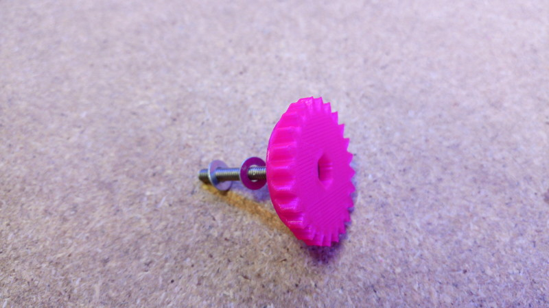

[M3x25mm hex head screw]: Hardware.yaml#HexBolt_M3x25mm_SS
[M3 washers]: Hardware.yaml#Washer_M3_SS

Start screwing the gear into the actuator column from the top. Apply a small amount of [light oil]{Qty: "A few drops of"} to the screw thread, before you fully tighten the screw  
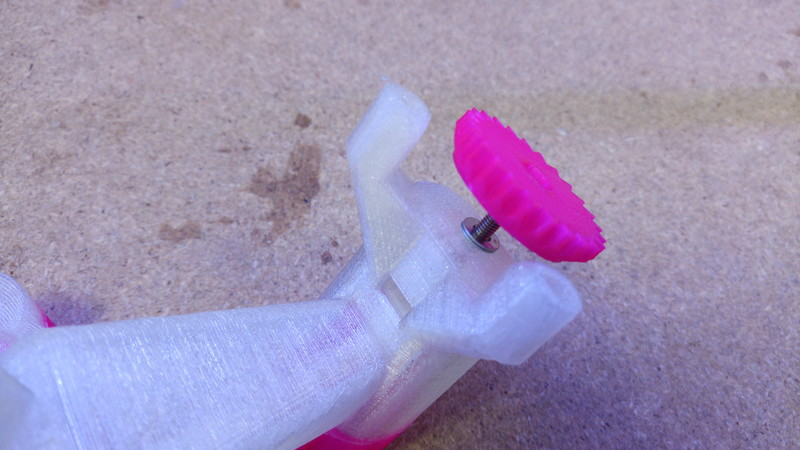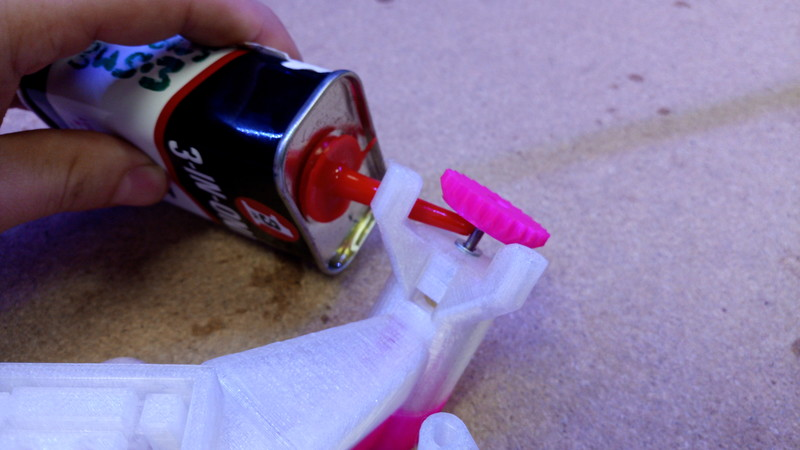

*Now comes the trickiest part. Once you get the knack this is easy, but it takes a few goes.*

Look through the hole you pushed the nut through, rotate the gear above until you see the hole inside align with it. Push the nut tool into the hole so the column cant move.

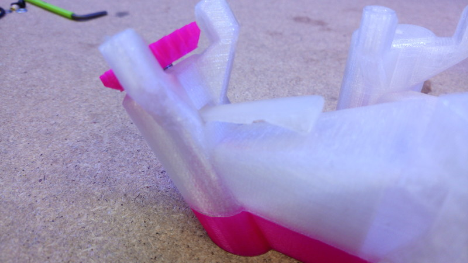

Bend the band tool (the longer of the two [actuator assembly tools](fromstep){Qty:1, cat:PrintedTool}) ready for use.  
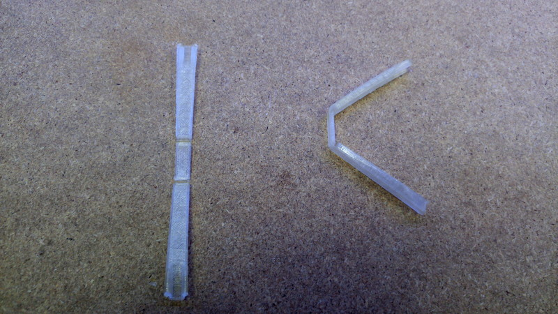

Turn the stage upside down and hold an [O-ring][Viton O-ring 30x2mm]{Qty: 3} over the holes in the bottom of the actuator column.
[Viton O-ring 30x2mm]: Hardware.yaml#O-Ring_30x2_Viton "{note: 'You might want some spares!'}"

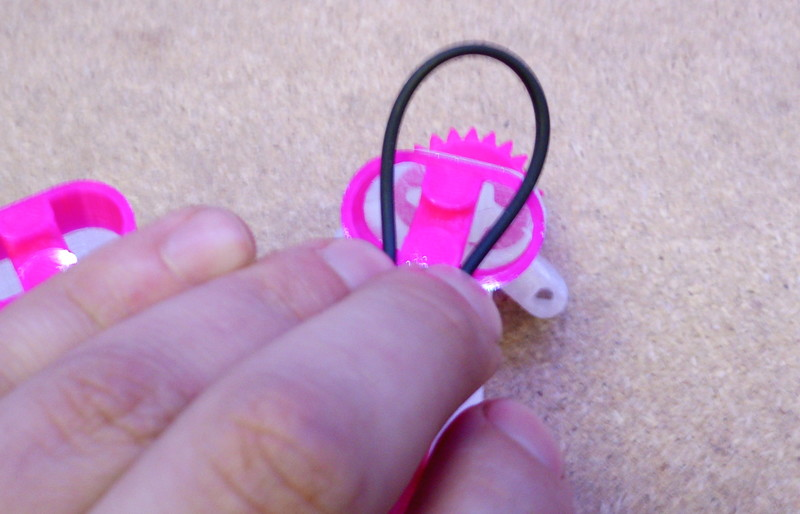

Push the band tool onto the two sides of the o-ring so that it begins to push the o-ring into the actuator column. Make sure that all both groves/hooks on each side of the tool are holding the band.

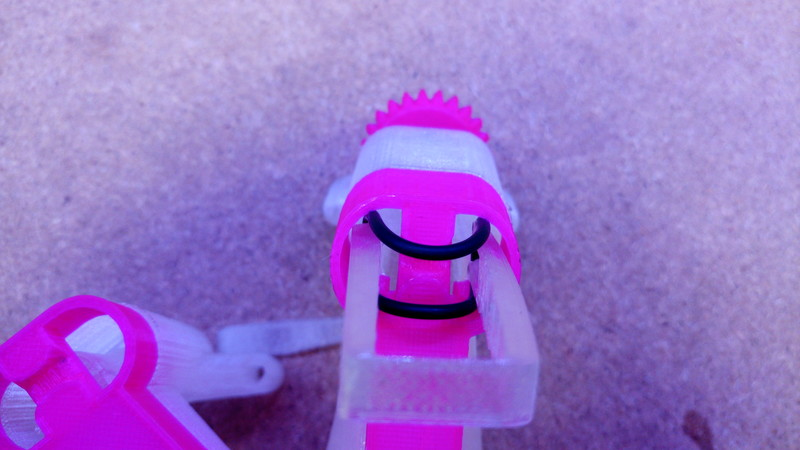

Now you want to push the tool into the leg with your thumbs, without letting the nut tool slip out. If the nut tool is too annoying you can also lock the column by  holding the gear (and screw) tight against the stage. You have to push pretty hard (normally requires both hands) but once you hear a satisfying click you should be done.

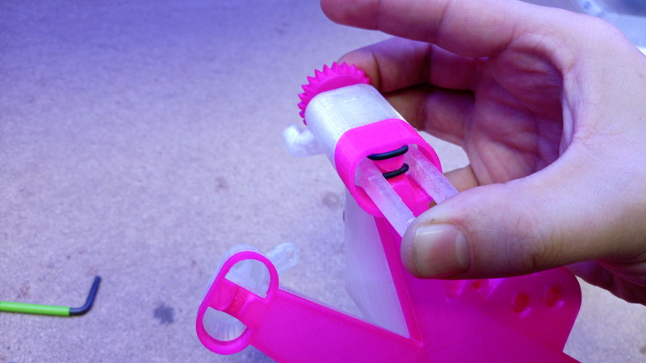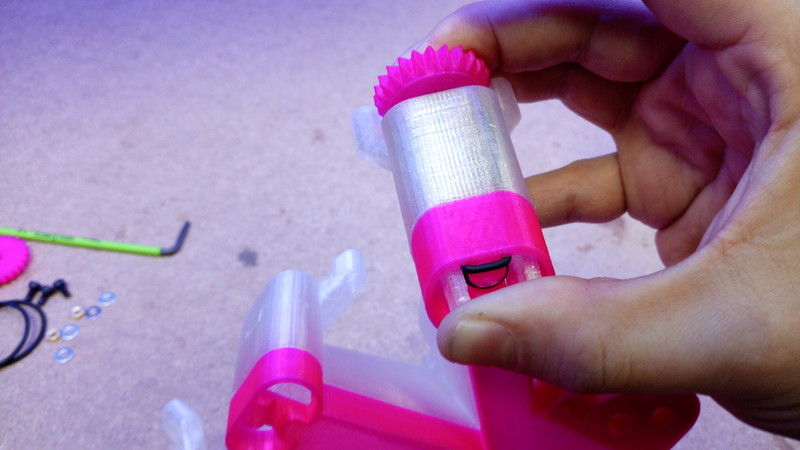

Remove the band tool. If it was successful the band should be held solidly in the actuator with both sides of the band neatly sitting in the grove. They need a bit of positioning. If you have enough light you can see that the bands are held onto small hooks inside the actuator column. If this didn't work the first time you can pull the band out and try again. If the bands are snapping it is probably a sign that you are not locking the actuator column with the nut tool.

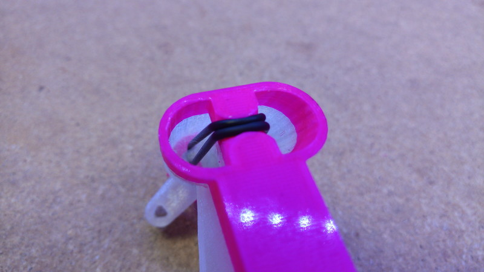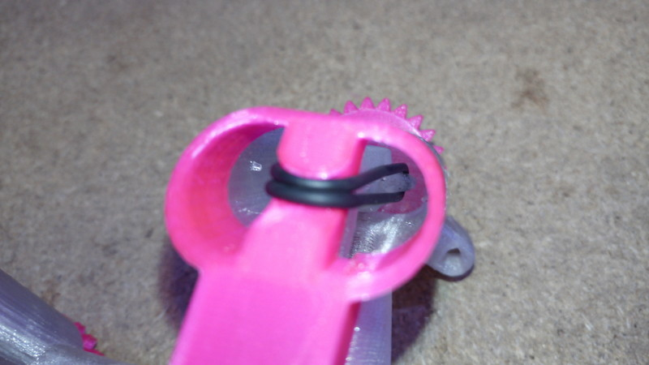

## Assemble the other actuators {pagestep}

Repeat this process for all three actuators.

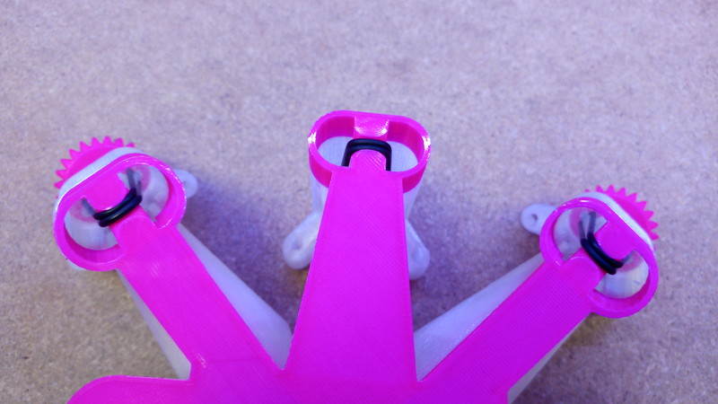

