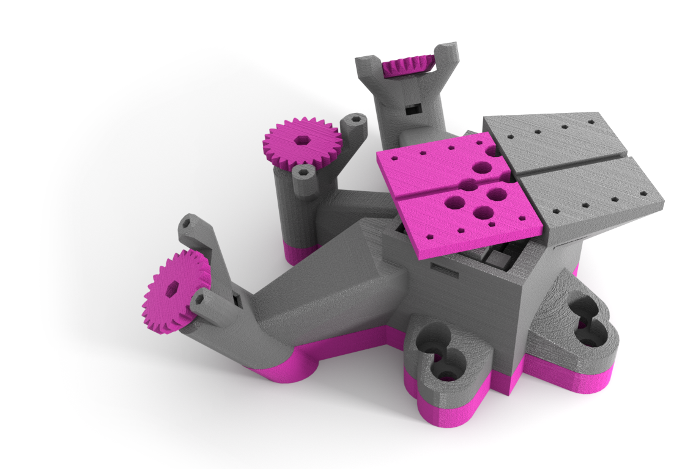
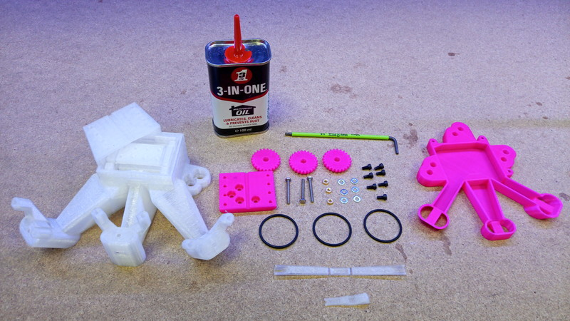
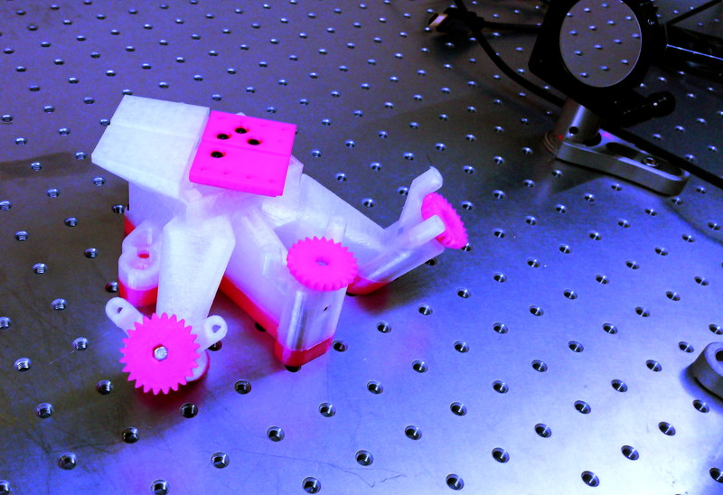

# OpenFlexure Block Stage

The OpenFlexure Block Stage is a 3D printed *x-y-z* translation stage. It is described in the [Optics Express article](open access).
Before you start building the microscope you will need to source all the components listed in the [bill of materials]{bom}.
Full source code for the STL files and instructions is available on [GitLab].

[Optics Express article]: https://doi.org/10.1364/OE.384207
[GitLab]: https://gitlab.com/openflexure/openflexure-block-stage/

* First, [print the plastic parts](print_parts.md){step}.
* Next, [prepare the printed parts](prepare_parts.md){step} for use.
* Next, [assemble the actuators](assemble_actuators.md){step}.
* Finally, [mount the platform and motors](mount_platform.md){step}.
* You may want to print some [accessories](accessories.md) depending on your intended use.

The completed stage will look like the image below:

