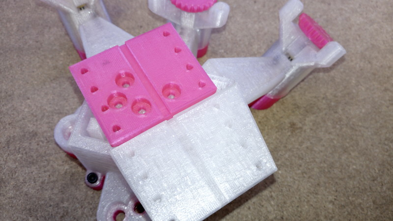
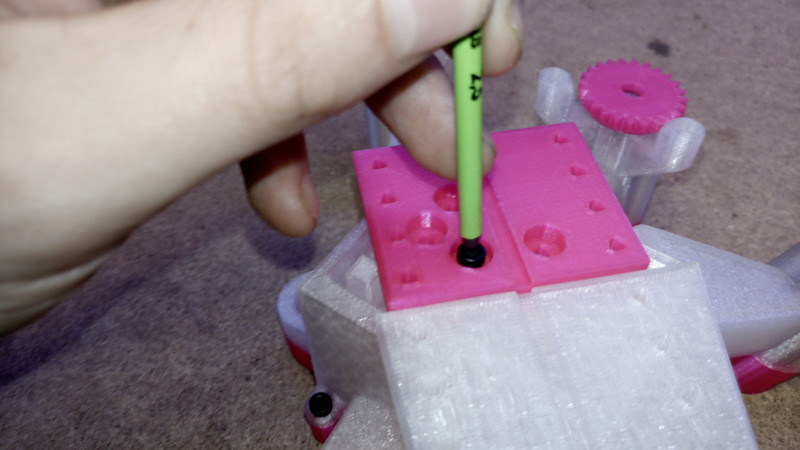
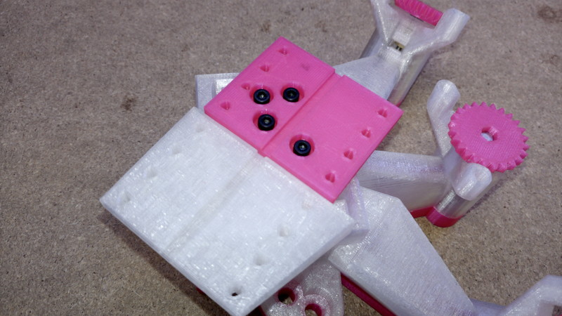

# Mount the moving platform

{{BOM}}

## Attaching the moving platform {pagestep}
 
Take the [prepared moving platform](fromstep){qty:1, cat:3DPrinted} and place it onto the centre of the stage so that the slot aligns with the slot on the fixed platform, and the four central holes align with holes in the mechanism.

Attach the platform to the stage with four [M3x6mm screws][M3x6mm screw]{Qty: 4}, this requires a [2.5mm Allen key]{Qty: 1}.

[M3x6mm screw]: Hardware.yaml#CapScrew_M3x6mm_SS
[2.5mm Allen key]: "{cat:tool}"

## Attaching motors - Optional

[28BYJ-48 micro geared stepper motors]: Hardware.yaml#28BYJ-48 "{note: 'Only if using motors'}"

Push each of the [small gears](fromstep){Qty: 3, cat:3DPrinted, note: "Only if using motors"} onto each [stepper motor][28BYJ-48 micro geared stepper motors]{Qty: 3}.

Attach motors to the main body such that the gears mesh with the gears on the actuators. Use two [M4x6mm button head screws]{Qty: 6} per motor (requires [2.5mm Allen key]{Qty: 1}) to secure them in place.

[M4x6mm button head screws]: Hardware.yaml#ButtonScrew_M4x6mm_SS

## Completed

Your stage is now ready to use in the lab.

